

  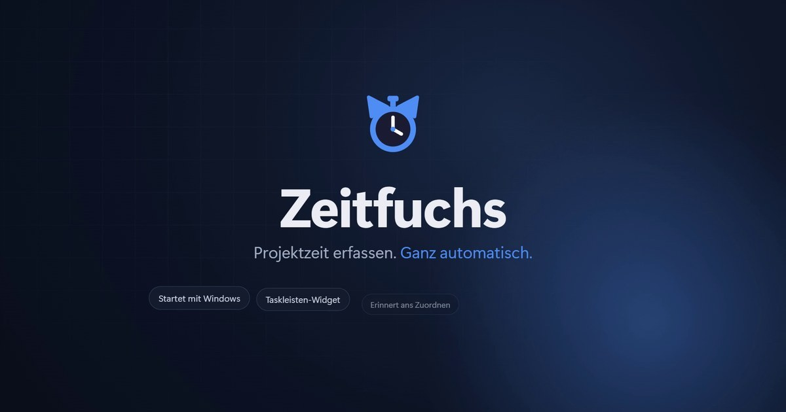

<h3 align="center">Die Zeiterfassung für Windows, die von selbst mitläuft.</h3>

  <a href="https://github.com/LinaLarsson42/zeitfuchs-releases/releases/latest/download/Zeitfuchs-win-Setup.exe"><b>⬇ Kostenlos herunterladen</b></a>
  &nbsp;·&nbsp; Windows 10 und 11 &nbsp;·&nbsp; ohne Konto &nbsp;·&nbsp; ohne Abo &nbsp;·&nbsp; Daten bleiben auf deinem PC

https://github.com/user-attachments/assets/0ebe370f-e25f-4f9c-9ee3-30390248f567

---

## Warum Zeitfuchs?

Monatsende, die Rechnung muss raus – und der Dienstag ist ein schwarzes Loch. Zeitfuchs startet mit deinem PC und zeichnet auf, woran du arbeitest. Dein aktuelles Projekt steht in der Taskleiste, ein Klick wechselt es – und läuft Zeit ohne Projekt, erinnert dich Zeitfuchs.

Gemacht für alle, die Zeit für **mehrere Projekte oder Kund:innen** erfassen müssen, zum Beispiel für die Abrechnung.

## PC an. Zeitfuchs läuft.

Kein Start-Knopf, kein Stempeln. Bis du ein Projekt wählst, sammelt sich die Zeit unter „Ohne Zuordnung“. Gewechselt wird mit einem Klick – im Taskleisten-Widget, im Tray-Menü oder unten links im Hauptfenster.

## Dein Projekt. Immer im Blick.

Das **Taskleisten-Widget** zeigt, worauf gerade gebucht wird – ein Klick auf den Pfeil, Projekt auswählen, fertig. Alternativ gibt es ein schwebendes Timer-Widget.

  
  &nbsp;
  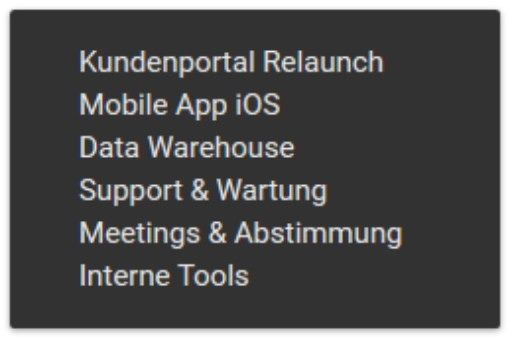
  &nbsp;
  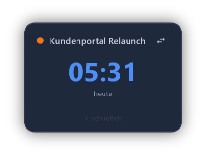

## Nichts geht verloren.

Arbeitest du, ohne dass ein Projekt läuft, fragt Zeitfuchs nach ein paar Minuten nach, wohin die Zeit gehört. Nach Standby oder Pause entscheidest du, ob und wie die Zeit gebucht wird.

  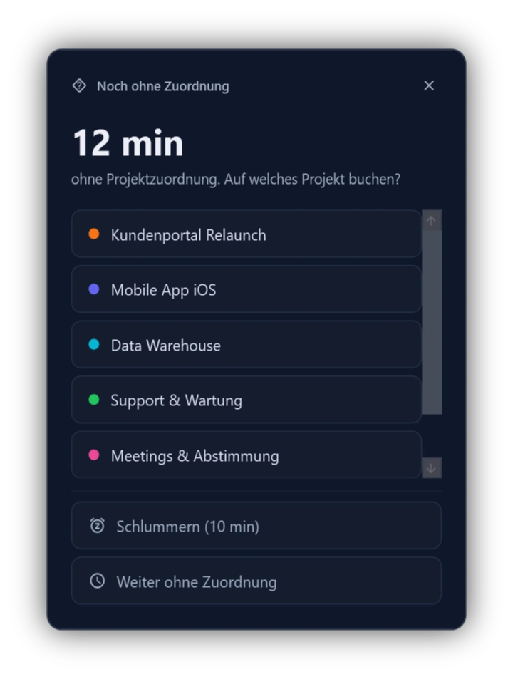
  &nbsp;
  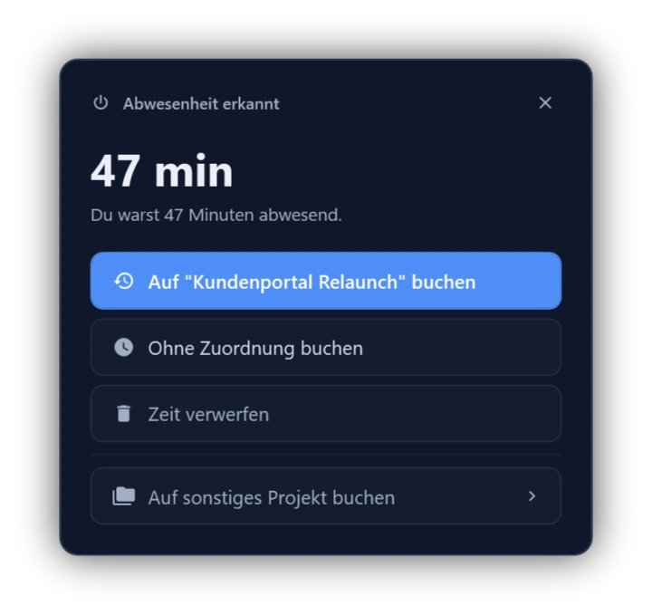

## Jede Minute. Richtig zugeordnet.

Der Kalender zeigt deine Zeiten als Monat, Woche oder Tag – farbig nach Projekt, mit Projektfilter und deinen Fristen. Im Tagesdetail korrigierst du alles nachträglich.

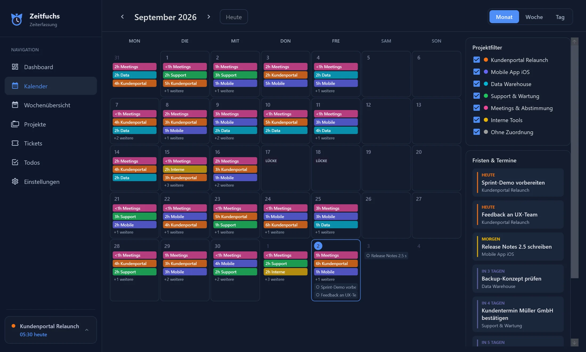

## Jede Stunde abrechenbar.

Die Wochenübersicht zeigt pro Tag Arbeitsbeginn, Feierabend, Gesamtzeit und eine Spalte je Projekt. Urlaub, Krankheit und Feiertage markierst du direkt in der Zeile, das Überstundenkonto rechnet jede Woche automatisch ab. Ein Klick auf **CSV exportieren** – fertig für Excel, die Rechnung oder das System deiner Firma.

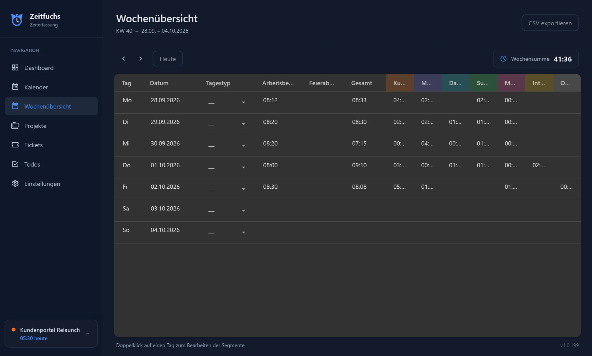

## Tickets, Todos & Budgets

Ein Ticket-Board (Offen, In Bearbeitung, PR, Ausgeliefert) mit Priorität, Link, Version und Verlauf, Todos mit Fälligkeit und ein Stundenbudget je Projekt mit Tacho im Dashboard.

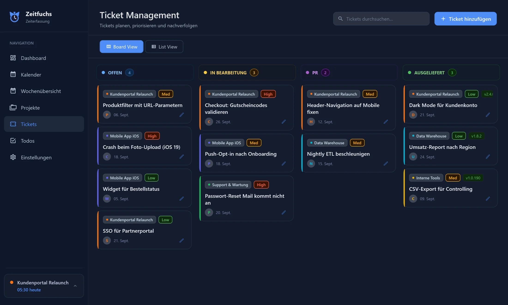

## Drei Farbschemata, drei Tachos

Automotive mit Zeigernadel, Schiefer mit Fortschrittsring, Sand mit Balken – jeweils hell oder dunkel.

  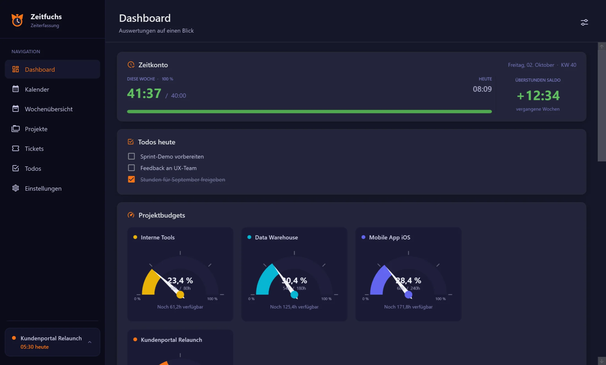
  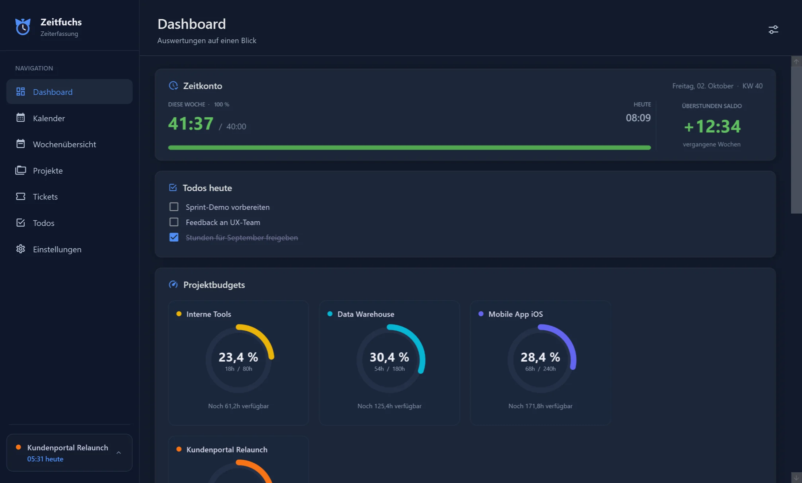
  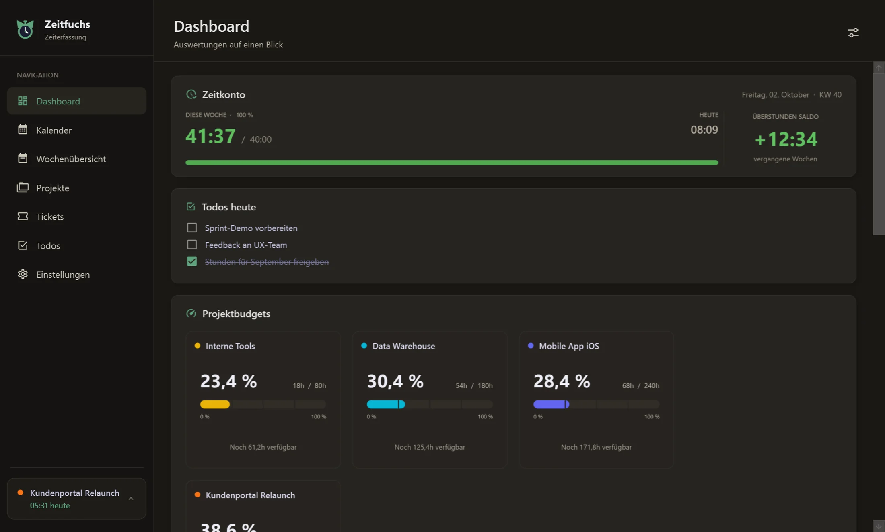

---

## Installation

1. [**Zeitfuchs-win-Setup.exe**](https://github.com/LinaLarsson42/zeitfuchs-releases/releases/latest/download/Zeitfuchs-win-Setup.exe) herunterladen und starten.
2. Falls Windows SmartScreen warnt („Windows hat den PC geschützt“): auf **Weitere Informationen** → **Trotzdem ausführen** klicken. Die Warnung erscheint bei Programmen, die noch nicht oft heruntergeladen wurden.
3. Beim ersten Start führt dich eine kurze Einführung durch die wichtigsten Funktionen.

Updates kommen automatisch – Zeitfuchs meldet sich, sobald eine neue Version bereitliegt. Alle Versionen findest du unter [Releases](https://github.com/LinaLarsson42/zeitfuchs-releases/releases).

## Deine Daten

Zeitfuchs speichert alles lokal in deinem Windows-Benutzerordner (`%LOCALAPPDATA%\ZeitfuchsData`). Es gibt kein Konto und keinen Server, der deine Zeiten sieht. Die App verbindet sich nur mit GitHub, um nach Updates zu suchen – und mit Google Forms, wenn du selbst Feedback abschickst.

## Feedback

Fehlt dir etwas? In der App gibt es links in der Seitenleiste den Punkt **Feedback** – auf Wunsch anonym. Ich lese jede Nachricht.

---

Dieses Repository enthält nur die Installations- und Update-Dateien (Velopack). Der Quellcode liegt in einem privaten Repository.
